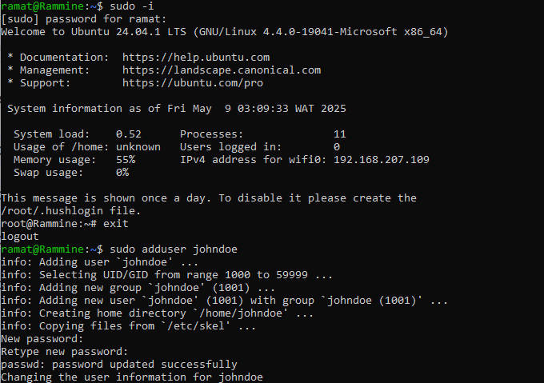
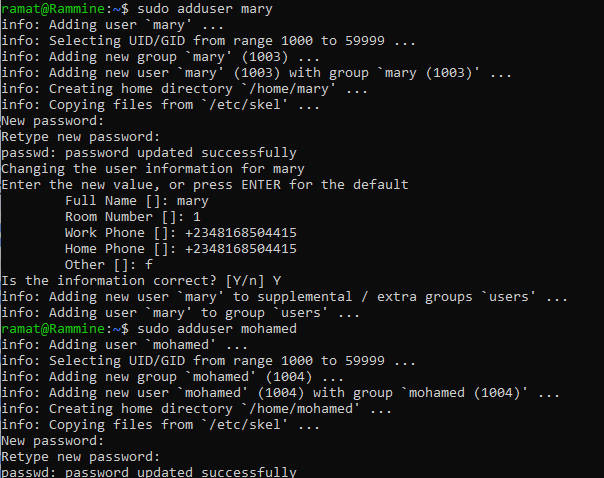
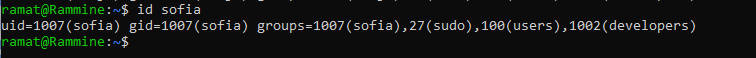

# advanced-linux

## Those are advanced linux commands use in manipulations of file and directories.

### Some of the commands are:

- sudo: it is used to carried out special permisdsion on files and directories.

- chmod: it is used to modify files permissions.

- touch: it is used to create files. 

- ls: it is used to lists all files or directories.

- chown: it is used to change ownership of files and directories.

- su: it is used to switch user account.

 - id: used to displayed users informations.

 

 

 

 

 

 

 

 

 

 

 

 
